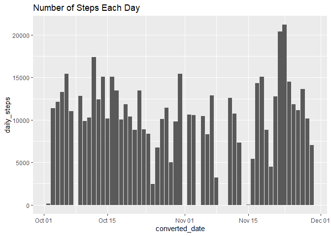
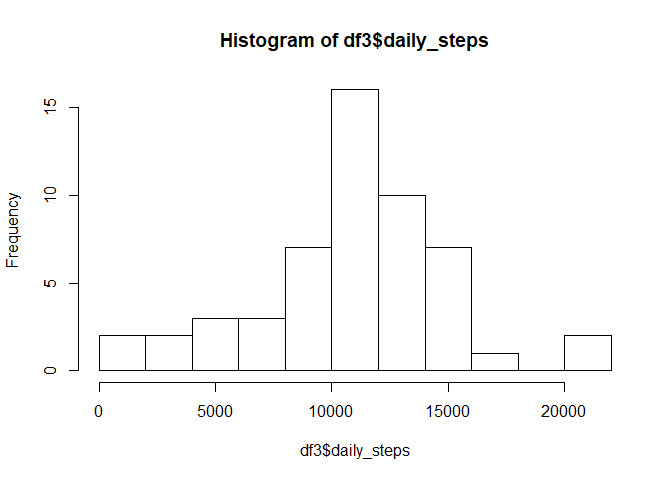
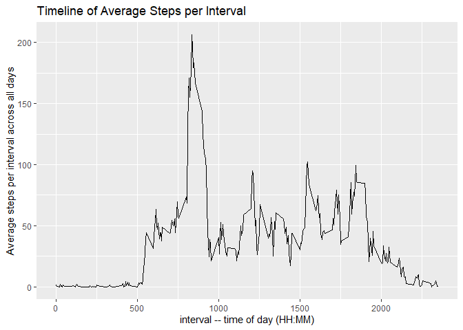
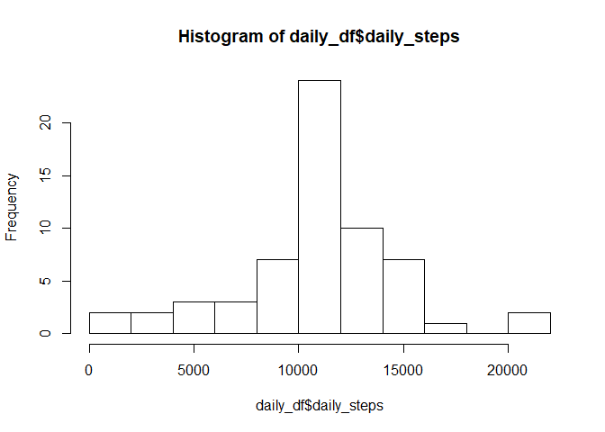
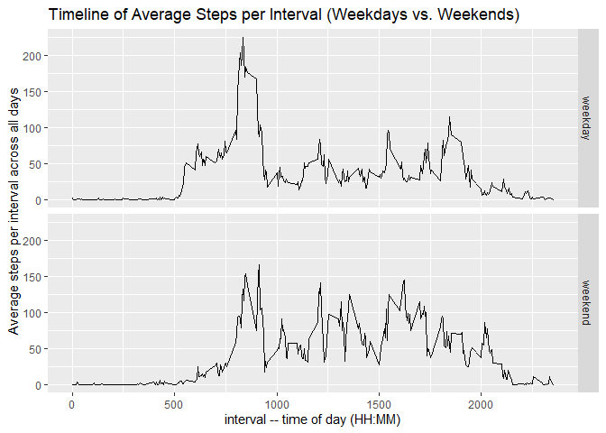

# Loading and preprocessing the data

### Load libraries

```r
library(dplyr)
```

```
## 
## Attaching package: 'dplyr'
```

```
## The following objects are masked from 'package:stats':
## 
##     filter, lag
```

```
## The following objects are masked from 'package:base':
## 
##     intersect, setdiff, setequal, union
```

```r
library(lubridate)
```

```
## 
## Attaching package: 'lubridate'
```

```
## The following objects are masked from 'package:base':
## 
##     date, intersect, setdiff, union
```

```r
library(ggplot2)
```

### Unzip and Load the data file  
### Read the file activity.csv into an R data frame  
### Preprocess the data to summarize the number of steps each day.

```r
zipfile <- "activity.zip"
exdir = "data"
unzip(zipfile, exdir=exdir)
infile <- "data/activity.csv"
df <- read.csv(infile)
df2 <- df %>% mutate (converted_date = ymd(date), na_steps = is.na(steps), ID = row_number())
df3 <- df2 %>% group_by( converted_date ) %>% summarize(daily_steps = sum(steps), missing_steps = sum(na_steps))
```

```
## `summarise()` ungrouping output (override with `.groups` argument)
```

# What is mean total number of steps taken per day?


### Show the mean number of daily steps

```r
original_mean <- mean(df3$daily_steps, na.rm = TRUE )
original_mean
```

```
## [1] 10766.19
```

### SHow the median for daily steps

```r
original_median <- median(df3$daily_steps, na.rm = TRUE )
original_median
```

```
## [1] 10765
```

### Show the number of steps each day in a bar chart

```r
ggplot(df3, mapping=aes(x=converted_date, y=daily_steps)) + 
  geom_bar(stat = "identity") +
  labs(title="Number of Steps Each Day")
```

```
## Warning: Removed 8 rows containing missing values (position_stack).
```

<!-- -->


### show a histogram of frequency values for daily steps

```r
hist(df3$daily_steps,breaks=10)
```

<!-- -->


# What is the average daily activity pattern?

### Group steps by interval, so we can compute the mean and sum for each interval

```r
steps_by_interval <- df2 %>% group_by ( interval ) %>% 
  summarize (sum_steps = sum(steps, na.rm=TRUE), 
             mean_steps = mean(steps, na.rm=TRUE),
             average_steps_integer = as.integer(round(mean_steps, 0)),
             count_steps = sum(!is.na(steps)))
```

```
## `summarise()` ungrouping output (override with `.groups` argument)
```

### Plot the timeline of average steps versus interval, averaged across all days

```r
g <- ggplot(steps_by_interval, mapping=aes(x=interval, y=mean_steps)) + geom_line()
g <- g + xlab("interval -- time of day (HH:MM)")
g <- g + ylab("Average steps per interval across all days")
g <- g + ggtitle("Timeline of Average Steps per Interval")
g
```

<!-- -->

### Determine the maximum average step value across intervals.

```r
max_steps <- max( steps_by_interval$mean_steps)
max_steps
```

```
## [1] 206.1698
```


```r
### Determine which time interval has the max_steps value.
max_steps_interval <- steps_by_interval[steps_by_interval$mean_steps == max_steps, ]$interval
max_steps_interval
```

```
## [1] 835
```

## Apparently the largest number of average steps 206.1698 occurred at interval
## 835 or 8:35 a.m.


# Imputing missing values

### 1. Calculate and report the total number of missing values in the dataset
### (i.e. the total number of rows with `NA`s)

```r
summary(df2)
```

```
##      steps                date          interval      converted_date      
##  Min.   :  0.00   2012-10-01:  288   Min.   :   0.0   Min.   :2012-10-01  
##  1st Qu.:  0.00   2012-10-02:  288   1st Qu.: 588.8   1st Qu.:2012-10-16  
##  Median :  0.00   2012-10-03:  288   Median :1177.5   Median :2012-10-31  
##  Mean   : 37.38   2012-10-04:  288   Mean   :1177.5   Mean   :2012-10-31  
##  3rd Qu.: 12.00   2012-10-05:  288   3rd Qu.:1766.2   3rd Qu.:2012-11-15  
##  Max.   :806.00   2012-10-06:  288   Max.   :2355.0   Max.   :2012-11-30  
##  NA's   :2304     (Other)   :15840                                        
##   na_steps             ID       
##  Mode :logical   Min.   :    1  
##  FALSE:15264     1st Qu.: 4393  
##  TRUE :2304      Median : 8784  
##                  Mean   : 8784  
##                  3rd Qu.:13176  
##                  Max.   :17568  
## 
```

### The summary function shows that 2304 values of steps are NA.

```r
dates_with_na_steps <- df2 %>% filter(is.na(steps)) %>% 
  group_by(date) %>% summarize(count_of_nas =n())
```

```
## `summarise()` ungrouping output (override with `.groups` argument)
```

```r
dates_with_na_steps
```

```
## # A tibble: 8 x 2
##   date       count_of_nas
##   <fct>             <int>
## 1 2012-10-01          288
## 2 2012-10-08          288
## 3 2012-11-01          288
## 4 2012-11-04          288
## 5 2012-11-09          288
## 6 2012-11-10          288
## 7 2012-11-14          288
## 8 2012-11-30          288
```

### It turns out that there are 288 5-minute intervals each day,
### and we are missing all of the steps data on 8 full days.
### This accounts for all of the 2304 = 8 * 288 missing values.

## 2. Devise a strategy for filling in all of the missing values in the dataset. 
## The strategy does not need to be sophisticated. For example, 
## you could use the mean/median for that day, or the mean for that 5-minute interval, etc.
## 3. Create a new dataset that is equal to the original dataset but with the missing data filled in.

### Create a function to replace a missing step value
### with the corresponding average for that 5 minute interval
### across all the days with data.

```r
impute_step_value <- function( steps, interval ) {
  if(!is.na(steps)) {
    ## just return the same steps value where data is present.
    result <- steps
  } else {
    ## interval is an integer in 24 hour time format HH:MM
    ## We want to find an index based on the number of 5 minute intervals
    ## within the current day.
    index <- 1 + 12 * (interval %/% 100) + (interval %% 60) %/% 5
    ## for missing values return the average for that time of day
    ## (rounded to an intger).
    result <- steps_by_interval$average_steps_integer[index]
  }
  if(is.na(result)) {
    print(paste('interval: ', interval))
  }
  result
}
```

### create a function to call impute_step_value for
### each row of data.frame df2

```r
impute_row <- function(row_index) {
  impute_step_value(df2$steps[row_index], df2$interval[row_index])
}
```

### Create a vector of the original step values merged with imputed step values.

```r
steps_imputed <- sapply(1:nrow(df2), impute_row)
```

### Form a new data.frame with selected columns  and including the imputed step values.

```r
imputed_steps_df <- df2 %>% select( date, interval, converted_date ) %>% cbind(steps_imputed)
```

### Group the data by date to sum total steps per day

```r
daily_df <- imputed_steps_df %>% group_by( converted_date ) %>% summarize(daily_steps = sum(steps_imputed))
```

```
## `summarise()` ungrouping output (override with `.groups` argument)
```

## 4. Make a histogram of the total number of steps taken each day and Calculate and 
## report the **mean** and **median** total number of steps taken per day. 
## Do these values differ from the estimates from the first part of the assignment? 
## What is the impact of imputing missing data on the estimates of the total daily number of steps?

```r
hist(daily_df$daily_steps,breaks=10)
```

<!-- -->

### Compare mean and median after imputing steps to the orginal values.

```r
mean(daily_df$daily_steps)
```

```
## [1] 10765.64
```

```r
original_mean
```

```
## [1] 10766.19
```

```r
median(daily_df$daily_steps)
```

```
## [1] 10762
```

```r
original_median
```

```
## [1] 10765
```
### The means and medians are close but do not exactly match. This is reasonable
### because we have added some estimated data.

# Are there differences in activity patterns between weekdays and weekends?

## For this part the `weekdays()` function may be of some help here. Use
## the dataset with the filled-in missing values for this part.

## 1. Create a new factor variable in the dataset with two levels -- 
## "weekday" and "weekend" indicating whether a given date is a weekday or weekend day.

## Define a new function to detect weekend days from day names.
## Then categorize each row of the data set as weekday or weekend.

```r
weekends <- function(day_of_week) {
  if("Saturday" == day_of_week || "Sunday" == day_of_week)  {
    weekend <- "weekend"
  } else {
    weekend <- "weekday"
  }
  weekend
}

new_dataset <- imputed_steps_df %>% 
  mutate(day_of_week=weekdays(converted_date))

day_type <- sapply(new_dataset$day_of_week, weekends)

new_dataset <- cbind(new_dataset, day_type)
  
str(new_dataset)
```

```
## 'data.frame':	17568 obs. of  6 variables:
##  $ date          : Factor w/ 61 levels "2012-10-01","2012-10-02",..: 1 1 1 1 1 1 1 1 1 1 ...
##  $ interval      : int  0 5 10 15 20 25 30 35 40 45 ...
##  $ converted_date: Date, format: "2012-10-01" "2012-10-01" ...
##  $ steps_imputed : int  2 0 0 0 0 2 1 1 0 1 ...
##  $ day_of_week   : chr  "Monday" "Monday" "Monday" "Monday" ...
##  $ day_type      : Factor w/ 2 levels "weekday","weekend": 1 1 1 1 1 1 1 1 1 1 ...
```

```r
summary(new_dataset)
```

```
##          date          interval      converted_date       steps_imputed   
##  2012-10-01:  288   Min.   :   0.0   Min.   :2012-10-01   Min.   :  0.00  
##  2012-10-02:  288   1st Qu.: 588.8   1st Qu.:2012-10-16   1st Qu.:  0.00  
##  2012-10-03:  288   Median :1177.5   Median :2012-10-31   Median :  0.00  
##  2012-10-04:  288   Mean   :1177.5   Mean   :2012-10-31   Mean   : 37.38  
##  2012-10-05:  288   3rd Qu.:1766.2   3rd Qu.:2012-11-15   3rd Qu.: 27.00  
##  2012-10-06:  288   Max.   :2355.0   Max.   :2012-11-30   Max.   :806.00  
##  (Other)   :15840                                                         
##  day_of_week           day_type    
##  Length:17568       weekday:12960  
##  Class :character   weekend: 4608  
##  Mode  :character                  
##                                    
##                                    
##                                    
## 
```

## Make a panel plot containing a time series plot (i.e. `type = "l"`) of the
## 5-minute interval (x-axis) and the average number of steps taken, 
## averaged across all weekday days or weekend days (y-axis).

### Prepare the data, grouping by interval and weekday vs. weekend

```r
steps_by_interval2 <- new_dataset %>% group_by ( interval, day_type ) %>% 
  summarize (sum_steps = sum(steps_imputed), 
             mean_steps = mean(steps_imputed))
```

```
## `summarise()` regrouping output by 'interval' (override with `.groups` argument)
```


### Plot the timeline of average steps versus interval, averaged across all days
### with weekdays versus weekends in separate panels

```r
g <- ggplot(steps_by_interval2, mapping=aes(x=interval, y=mean_steps)) + geom_line()
g <- g + facet_grid(day_type ~ .)
g <- g + xlab("interval -- time of day (HH:MM)")
g <- g + ylab("Average steps per interval across all days")
g <- g + ggtitle("Timeline of Average Steps per Interval (Weekdays vs. Weekends)")
g
```

<!-- -->

